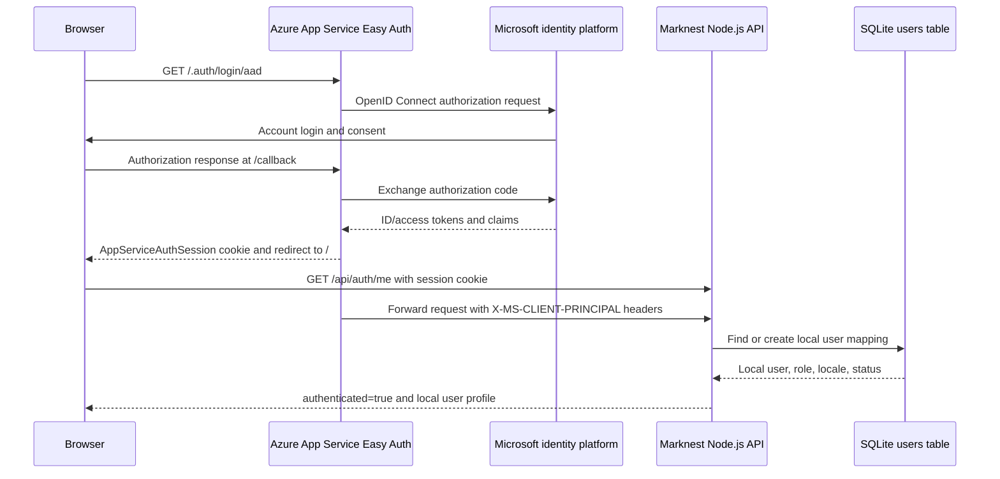

# Microsoft Account Authentication

This document describes how Microsoft Account login works in Marknest, where
the related Azure configuration is located, and how the application converts an
Azure identity into a local Marknest user.

## Azure Resource Locations

### App Service Easy Auth

Easy Auth is not a separate top-level Azure resource. It is an authentication
configuration attached to the Marknest Web App.

Current resource:

| Property | Value |
| --- | --- |
| Subscription | `608633d1-cbfb-4a74-9377-b956f3640cda` |
| Resource group | `marknest-prod-rg` |
| Web App | `marknest-608633d1-0cda` |
| Portal location | App Service > `marknest-608633d1-0cda` > Authentication |
| ARM child resource | `Microsoft.Web/sites/config/authsettingsV2` |

The ARM resource ID is:

```text
/subscriptions/608633d1-cbfb-4a74-9377-b956f3640cda
/resourceGroups/marknest-prod-rg
/providers/Microsoft.Web/sites/marknest-608633d1-0cda
/config/authsettingsV2
```

The current Easy Auth behavior is:

- Authentication platform enabled
- Anonymous access allowed for public articles
- Microsoft Entra ID provider enabled
- HTTPS required
- Token store enabled
- Authentication session cookie lifetime: eight hours
- Logout endpoint: `/.auth/logout`

### Microsoft Entra Application

The OAuth/OpenID Connect client is a Microsoft Entra application registration.
It is tenant-level metadata and therefore does not appear inside the App Service
resource group.

| Property | Value |
| --- | --- |
| Tenant ID | `487cab16-e77e-4753-b8ba-8d0ed7c93332` |
| Portal location | Microsoft Entra ID > App registrations |
| Display name | `marknest-production-login` |
| Application/Client ID | `eb01e682-785c-4b81-940e-3566a2dedf0a` |
| Supported accounts | Organizational and personal Microsoft accounts |
| ID token issuance | Enabled |

The registered redirect URI is:

```text
https://marknest-608633d1-0cda.azurewebsites.net/.auth/login/aad/callback
```

The application secret is not committed to this repository. It is stored in the
Web App application setting:

```text
MICROSOFT_PROVIDER_AUTHENTICATION_SECRET
```

The Easy Auth configuration references the setting by name and does not contain
the secret value.

## Authentication Flow



Marknest never receives the Microsoft account password. Token exchange,
validation, and the session cookie are handled by Azure App Service Easy Auth.

## Frontend Implementation

Production login starts in `src/api.js`:

```text
/.auth/login/aad?post_login_redirect_uri=/
```

After login, Microsoft redirects to the Easy Auth callback. Easy Auth validates
the response, creates the `AppServiceAuthSession` cookie, and redirects the
browser back to `/`.

On page initialization, `src/app.js` requests:

```text
GET /api/auth/me
```

Requests use:

- `credentials: same-origin` so the Easy Auth session cookie is included
- `cache: no-store` so an anonymous response is not reused after login

When the API returns an authenticated user, the header displays:

- User display name
- Email address or authentication provider
- Marknest role
- Logout button

Production logout navigates to:

```text
/.auth/logout?post_logout_redirect_uri=/
```

Easy Auth clears the application session and returns the browser to Marknest.

## Backend Identity Mapping

Azure injects identity information before forwarding the request to Node.js.
Depending on the Easy Auth runtime and account type, identity data can be split
across:

```text
X-MS-CLIENT-PRINCIPAL
X-MS-CLIENT-PRINCIPAL-ID
X-MS-CLIENT-PRINCIPAL-IDP
X-MS-CLIENT-PRINCIPAL-NAME
```

`server/auth.js` merges the two representations:

- The encoded principal supplies claims such as display name and email.
- The split headers supply the stable provider user ID when it is absent from
  the encoded principal.

The normalized identity contains:

```text
provider
providerUserId
name
email
```

`upsertUser()` maps `(auth_provider, provider_user_id)` to one row in the local
`users` table. On first login it creates the user. On later logins it updates
the synchronized name, email, and last login time.

The database does not store Microsoft passwords, OAuth authorization codes,
access tokens, ID tokens, or the Easy Auth session cookie.

## Roles and Administrators

New users receive the `user` role unless their stable identity is listed in:

```text
ADMIN_IDENTITIES
```

The matching format is:

```text
<provider>:<provider-user-id>
```

For the current Microsoft provider, Easy Auth normally reports the provider as
`aad`. An example is:

```text
aad:00000000-0000-0000-0000-000000000000
```

The stable provider ID should be used instead of an email address because email
addresses can change or be reassigned.

## Automation and CI/CD

### One-Time Authentication Bootstrap

Run:

```powershell
.\scripts\configure-azure-auth.ps1
```

The script is idempotent and:

1. Selects and verifies the expected Azure subscription and tenant.
2. Creates or reuses `marknest-production-login`.
3. Configures the callback URI.
4. Enables ID token issuance required by the Easy Auth login flow.
5. Creates an application secret when one is not already stored.
6. Stores the secret directly in App Service settings.
7. Configures the Microsoft provider through the Azure `authV2` extension.
8. Enables Easy Auth while allowing anonymous access.

Rotate the Microsoft application secret with:

```powershell
.\scripts\configure-azure-auth.ps1 -RotateMicrosoftSecret
```

Application secrets currently have a one-year lifetime. Secret rotation should
be scheduled before expiration.

### Continuous Deployment

`scripts/provision-azure.sh`, called by the GitHub Actions deployment workflow,
reapplies the Easy Auth configuration on every deployment when
`MICROSOFT_AUTH_CLIENT_ID` exists in App Service settings.

The deployment workflow does not create or print a new Microsoft client secret.
It reuses the secret already stored in App Service.

## Operations

View the Easy Auth configuration:

```powershell
az webapp auth show `
  --resource-group marknest-prod-rg `
  --name marknest-608633d1-0cda
```

View the Entra application:

```powershell
az ad app show --id eb01e682-785c-4b81-940e-3566a2dedf0a
```

Check the authenticated Easy Auth session in the current browser:

```text
https://marknest-608633d1-0cda.azurewebsites.net/.auth/me
```

Check the Marknest local user mapping:

```text
https://marknest-608633d1-0cda.azurewebsites.net/api/auth/me
```

Expected Marknest response shape:

```json
{
  "authenticated": true,
  "user": {
    "username": "Example User",
    "email": "user@example.com",
    "auth_provider": "aad",
    "provider_user_id": "stable-provider-id",
    "role": "user"
  }
}
```

## Security Notes

- Never commit the Microsoft application secret.
- Never log OAuth tokens, session cookie values, or the encoded principal.
- Keep HTTPS enabled.
- Keep anonymous access enabled only because public article reading is a product
  requirement; protected API routes still call `requireUser()` or
  `requireAdmin()`.
- Use provider IDs, not email addresses, for authorization decisions.
- Rotate the Microsoft secret before it expires.
- If the Web App hostname changes, update the Entra redirect URI before
  switching traffic.
