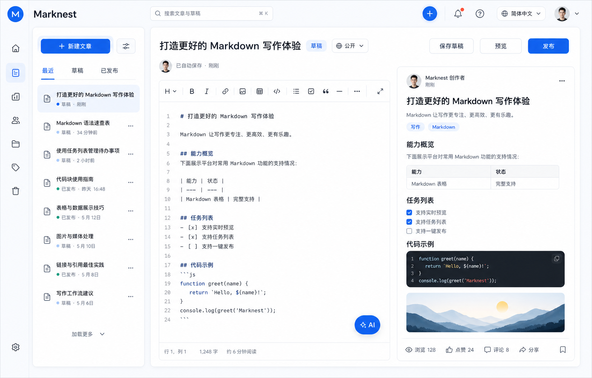

# 个人 Markdown Blog 平台产品文档

## 1. 产品概述

### 1.1 产品定位

本产品是一个面向个人创作者的在线 Blog 平台，核心能力是通过 Markdown 文件完成文章创作、管理、发布和分发。用户可以上传已有 `.md` 文件，也可以在网页中直接编辑 Markdown，系统将 Markdown 内容渲染为最终 Blog 页面。

平台重点服务技术文章、学习笔记、项目复盘、工具教程、经验分享等内容，也支持个人随笔、资料整理和其他知识型内容发布。

### 1.2 产品目标

- 为个人提供一个轻量、可持续维护的 Blog 创作空间。
- 支持 Markdown 上传、在线编辑、预览、发布和版本管理。
- 提供账号与权限体系，区分普通用户和管理员。
- 提供文章数据反馈，包括浏览、点赞、评论、转发等指标。
- 支持文章发布后转发到微信朋友圈、小红书等外部平台。
- 支持自动化测试、持续集成和自动化部署，可部署到 Azure。
- 使用 GitHub 管理代码、版本、Issue、Pull Request 和发布流程。

### 1.3 非目标范围

- 首期不做多人协作编辑。
- 首期不做复杂 CMS 工作流，例如多级审核、付费订阅、广告投放。
- 首期不直接替代微信公众号、小红书等平台的原生编辑器，只提供转发入口和适配内容能力。

## 2. 目标用户与受众

### 2.1 主要用户

#### 普通用户

普通用户是平台的主要内容创作者，通常具备以下特征：

- 技术开发者、学生、研究人员、产品经理、设计师或知识型创作者。
- 有使用 Markdown 写作的习惯。
- 希望集中管理个人文章、笔记和分享内容。
- 需要查看文章发布后的数据表现，例如浏览量、点赞数、评论数和转发数。

#### 管理员

管理员负责平台整体管理和数据查看，通常具备以下职责：

- 管理用户账号、文章内容、评论和平台配置。
- 查看全站数据和运营指标。
- 处理违规内容、异常评论或账号问题。
- 管理部署、发布、系统配置和权限策略。

### 2.2 次要用户

#### 访客读者

访客无需登录即可浏览已公开发布的文章。可根据平台设置进行点赞、评论或分享；如果互动功能要求登录，则访客需要使用第三方账号登录后使用。

## 3. 用户场景

### 3.1 普通用户上传已有 Markdown 文章

用户在本地已经写好一篇技术文章，希望快速发布到自己的 Blog。

流程：

1. 用户登录平台。
2. 进入文章管理页。
3. 点击上传 Markdown。
4. 选择本地 `.md` 文件。
5. 系统解析标题、正文、图片引用和元数据。
6. 用户补充分类、标签、摘要和封面图。
7. 用户预览渲染效果。
8. 用户保存为草稿或直接发布。

### 3.2 普通用户在线编辑文章

用户希望在网页中直接写作、修改和预览文章。

流程：

1. 用户新建文章。
2. 在 Markdown 编辑器中输入内容。
3. 右侧或独立预览区实时显示渲染结果。
4. 用户设置标题、标签、分类、可见性和发布时间。
5. 系统自动保存草稿。
6. 用户发布文章。

### 3.3 普通用户查看文章数据

用户发布文章后，希望了解文章表现。

可查看数据：

- 浏览量
- 点赞数
- 评论数
- 收藏数
- 转发数
- 最近访问趋势
- 评论列表
- 发布状态
- 更新时间

### 3.4 管理员查看全站内容和数据

管理员需要掌握平台整体运行情况。

可查看内容：

- 用户总数、活跃用户数、新增用户数
- 文章总数、已发布文章数、草稿数
- 全站浏览量、点赞量、评论量、转发量
- 热门文章列表
- 最近发布文章
- 异常内容或举报内容
- 系统部署状态和最近构建结果

### 3.5 用户将文章转发到外部平台

文章发布后，用户希望将链接或内容摘要转发到微信朋友圈、小红书等平台。

流程：

1. 用户进入已发布文章详情页。
2. 点击分享按钮。
3. 选择目标平台，例如微信朋友圈、小红书、复制链接、二维码。
4. 系统生成分享链接、摘要、封面图和平台适配文案。
5. 用户根据目标平台规则完成分享。

## 4. 角色与权限

### 4.1 权限角色

系统包含两类登录角色：

- 管理员
- 普通用户

访客可以浏览公开内容，但不属于登录角色。

### 4.2 权限矩阵

| 功能 | 访客 | 普通用户 | 管理员 |
| --- | --- | --- | --- |
| 浏览公开文章 | 支持 | 支持 | 支持 |
| 第三方账号登录 | 支持 | 支持 | 支持 |
| 上传 Markdown | 不支持 | 支持 | 支持 |
| 在线编辑自己的文章 | 不支持 | 支持 | 支持 |
| 删除自己的文章 | 不支持 | 支持 | 支持 |
| 查看自己的文章数据 | 不支持 | 支持 | 支持 |
| 评论文章 | 可配置 | 支持 | 支持 |
| 点赞文章 | 可配置 | 支持 | 支持 |
| 分享文章 | 支持 | 支持 | 支持 |
| 管理所有用户 | 不支持 | 不支持 | 支持 |
| 管理所有文章 | 不支持 | 不支持 | 支持 |
| 管理所有评论 | 不支持 | 不支持 | 支持 |
| 查看全站数据 | 不支持 | 不支持 | 支持 |
| 管理系统配置 | 不支持 | 不支持 | 支持 |
| 查看部署和测试状态 | 不支持 | 不支持 | 支持 |

## 5. 功能需求

### 5.1 账号管理

#### 第三方账号登录

平台不提供自身的用户名、邮箱、密码注册体系。用户通过受支持的第三方身份提供商登录，平台只保存必要的账号映射、角色和资料信息。

首期建议支持：

- Microsoft Account
- Google Account

后续可扩展：

- GitHub
- Apple ID
- 企业 Microsoft Entra ID

登录要求：

- 支持 OAuth 2.0 / OpenID Connect 登录。
- 支持登录状态保持。
- 支持退出登录。
- 首次第三方账号登录时，系统自动创建本地用户映射。
- 同一个第三方账号在平台内对应唯一用户。
- 不保存第三方账号密码。
- 不提供平台内密码重置，密码找回由第三方身份提供商处理。

#### 用户资料

- 用户可设置昵称、头像、个人简介、个人主页链接。
- 默认昵称、头像和邮箱可从第三方身份提供商同步，用户可在平台内修改展示资料。
- 用户可查看自己的文章列表、草稿和发布数据。

#### 登录后账号入口与账号详情

- 登录成功后，右上角用户头像或首字母图标必须可点击，打开账号菜单或账号详情面板。
- 账号菜单至少展示：显示名、邮箱（如身份提供商返回）、第三方登录提供商、平台角色、当前语言偏好和登录状态。
- 账号菜单提供退出登录、个人资料或偏好设置入口；管理员账号额外展示管理后台入口。
- 不展示第三方访问令牌、刷新令牌、内部 provider_user_id 等敏感字段；排障信息只允许在管理员受控调试页面中脱敏展示。
- 菜单支持点击外部区域和 Esc 关闭，并提供键盘焦点、aria-expanded、aria-controls 等基础无障碍能力。

#### 权限控制

- 用户登录后根据角色展示不同菜单和功能。
- 普通用户只能管理自己的文章和数据。
- 管理员可以查看和管理全站数据。

#### 管理员设置方式

平台通过“管理员白名单 + 管理后台角色管理”的方式设置管理员账号：

- 系统配置中维护管理员账号白名单，使用第三方账号的唯一身份标识作为依据，例如 provider + provider_user_id，也可辅助记录邮箱。
- 首次部署时，通过环境变量或配置文件设置初始管理员列表，例如 ADMIN_IDENTITIES。
- 用户通过第三方平台首次登录后，系统检查其身份是否命中管理员白名单；命中则自动授予管理员角色，否则默认为普通用户。
- 已有管理员可在管理后台将其他已登录用户设为管理员或取消管理员权限。
- 管理员角色变更必须写入审计日志，记录操作人、目标用户、变更前角色、变更后角色和时间。
- 为避免邮箱变更或邮箱被回收带来的风险，权限判断优先使用第三方身份提供商返回的稳定用户 ID，不只依赖邮箱。

### 5.2 UI 本地化与语言选择

平台支持 UI localization，让不同语言用户可以使用自己熟悉的界面语言。该功能只影响平台 UI 文案，不强制翻译用户创作的文章内容。

#### 支持语言

首期建议支持：

- 简体中文 zh-CN
- 英文 en-US

后续可扩展：

- 繁体中文 zh-TW
- 日文 ja-JP
- 韩文 ko-KR
- 其他用户增长较多的语言

#### 语言选择

- 页面顶部或用户设置中提供语言选择入口。
- 未登录访客也可以选择界面语言。
- 已登录用户的语言偏好保存到用户资料中。
- 未登录访客的语言偏好保存到浏览器本地存储或 Cookie。
- 首次访问时，系统可根据浏览器 `Accept-Language` 自动选择默认语言。
- 如果浏览器语言不在支持范围内，则默认使用简体中文或系统配置的默认语言。
- 用户手动选择语言后，优先级高于浏览器自动识别。

#### 本地化范围

需要本地化的内容：

- 导航菜单
- 登录和退出入口
- 按钮、表单标签、占位符和提示信息
- 文章管理、工作台、数据看板和管理员后台 UI 文案
- 错误提示、成功提示和确认弹窗
- 分享入口和平台适配提示
- 邮件、通知或系统消息中的固定模板文案

不自动本地化的内容：

- 用户自己创建的文章标题、摘要和正文
- 用户评论内容
- 用户自定义标签、分类和个人简介

#### 管理要求

- 本地化文案应使用统一的 message key 管理，不应把 UI 文案散落硬编码在页面中。
- 缺失翻译时应回退到默认语言。
- 管理员后台可查看当前支持的语言列表和默认语言配置。
- 后续可支持管理员导入或维护本地化文案。

#### 测试要求

- 验证用户可以切换语言。
- 验证刷新页面后语言选择仍然保留。
- 验证登录用户在不同设备登录后可以使用已保存的语言偏好。
- 验证缺失翻译会回退到默认语言。
- 验证 Markdown 文章内容不会因为切换 UI 语言而被改变。

### 5.3 UI 视觉与交互风格

平台整体采用简洁、克制、内容优先的知识型产品风格。视觉设计应突出 Markdown 写作与长文阅读，减少无关装饰，不使用过度拟物、强烈渐变或影响阅读的高频动画。

#### UI 概念稿

以下图片为桌面端创作工作台的第三版高保真概念稿，用于确认整体视觉方向、信息层级和编辑器布局，不代表最终逐像素设计。该版本采用现代社交内容平台的数字化视觉语言，强调清爽无衬线字体、紧凑信息密度、圆润控件、轻边框、蓝色主操作和明确的互动反馈，同时保持 Marknest 自身的信息架构与品牌独立性。后续实现可以根据可用性测试、响应式适配和实际组件能力调整细节。

概念稿重点：

- 顶部提供全局搜索、快速创建、通知、帮助、语言和用户入口，符合现代平台型产品使用习惯。
- 左侧采用极窄图标导航，文档库使用独立列表栏并提供最近、草稿和已发布筛选。
- 编辑区使用现代无衬线标题、轻量格式工具栏和无干扰 Markdown 输入区域。
- 主要操作聚焦为保存草稿、预览和蓝色发布按钮，避免大量同权重按钮横向堆叠。
- 实时预览采用现代内容卡片结构，展示作者、发布时间、标签、正文和更多操作。
- 文章底部展示浏览、点赞、评论、分享和收藏，形成内容发布后的完整互动闭环。
- 控件使用适度圆角、轻边框和浅蓝选中态，不使用厚重阴影或传统后台式灰色按钮。
- 主色采用专业明亮的蓝色，背景使用冷灰蓝，正文使用接近黑色的深蓝灰。
- 表格、任务列表、代码块和图片保持清晰，并与现代社交内容页面的阅读密度一致。

#### 设计原则

- 内容优先：文章正文、编辑器和预览区是页面视觉中心。
- 清晰高效：常用操作应容易发现，创建、保存、预览和发布流程不应被多层菜单阻断。
- 一致可预期：相同类型的按钮、表单、状态和反馈在不同页面使用一致样式与交互。
- 克制友好：使用适度留白、轻量边框和阴影建立层级，避免界面过度拥挤。
- 阅读舒适：正文行宽、字号、行高和段落间距应适合长时间阅读。
- 响应式优先：桌面端提供高效的分栏创作体验，移动端保证完整可用而非仅缩小桌面布局。
- 无障碍可用：颜色、键盘操作、焦点状态和语义结构满足基础可访问性要求。

#### 色彩与视觉层级

- 默认使用浅色中性背景、白色内容面板和深色正文文字。
- 品牌主色建议使用低饱和绿色或青绿色，用于主按钮、当前导航、链接和焦点状态。
- 强调色建议使用低饱和橙色或暖色，用于品牌辅助信息和少量重要提示。
- 成功、警告、错误、禁用状态必须使用稳定且一致的语义色，不能只依赖文字说明。
- 正文与背景的颜色对比度应达到 WCAG AA 基础要求；状态信息不能只通过颜色区分，还应配合文字、图标或形状。
- 阴影只用于浮层或需要强调层级的卡片，普通内容区域优先使用边框和留白分隔。

#### 字体与排版

- UI 默认使用系统无衬线字体，优先保证中英文混排清晰。
- Markdown 编辑器和代码块使用等宽字体。
- 正文推荐字号为 16 至 18 px，行高为 1.6 至 1.8，桌面端正文最大阅读宽度建议为 720 至 860 px。
- 标题层级应通过字号、字重和间距清晰区分，不使用过多颜色制造层级。
- 表格、代码块、引用、列表、图片说明和行内代码必须具有明确且一致的样式。
- 长链接、长代码和宽表格不得撑破页面；应换行或提供横向滚动。

#### 布局与间距

- 使用统一的间距体系，建议以 4 px 或 8 px 为基础单位。
- 页面结构优先采用“顶部栏 + 侧边导航 + 主内容区”。
- 阅读页在桌面端可采用文章列表与详情分栏；文章正文区域保持稳定阅读宽度。
- 工作台在宽屏下采用编辑器与实时预览双栏布局，窄屏下切换为上下布局或编辑/预览标签页。
- 表单标签、输入框、帮助信息和错误信息应形成清晰分组。
- 主要操作放置在页面顶部或编辑区域附近；危险操作与主要操作保持视觉和位置上的区分。

#### 导航栏与二级侧栏折叠

- 桌面端左侧一级导航支持图标模式和展开模式；图标模式必须提供 tooltip 或可访问名称，避免只靠用户猜测。
- 内容库、文章列表、编辑工作台等二级侧栏支持折叠和展开，用户可在需要沉浸阅读或写作时释放主内容区域宽度。
- 侧栏折叠状态应在同一设备上持久保存，例如使用本地存储记录用户偏好。
- 当前页面、当前文章和未保存状态在折叠后仍需可感知，不能因为折叠导致用户迷失上下文。
- 窄屏设备默认采用抽屉式导航或底部导航，打开后支持点击外部区域、Esc 和返回手势关闭。
- 折叠按钮必须具备明确图标、悬停说明、aria-expanded、aria-controls 和键盘操作能力。

#### 页面预制风格

平台应提供多套预制页面风格，让用户可以在不修改 Markdown 内容的情况下选择文章阅读页的呈现方式。

首批建议提供：

- 现代社交内容风格：默认风格，适合博客、观点和日常内容，强调作者信息、互动数据和分享入口。
- 极简长文阅读风格：弱化互动控件，突出正文、目录和阅读舒适度。
- 技术文档风格：强化目录、代码块、表格、标题锚点和版本信息，适合教程和工程文章。
- Newsletter/专栏风格：突出封面、摘要、订阅提示和作者品牌。
- 卡片封面风格：适合短内容或对外分发，强调封面图、摘要和社交平台分享效果。

风格选择规则：

- 支持站点默认风格和文章级覆盖；文章级设置优先于站点默认设置。
- 发布前必须可以预览不同风格效果。
- 风格只影响布局、字体、间距、颜色和互动模块呈现，不改变 Markdown 原文和语义结构。
- 不同风格都必须满足响应式、可访问性、图片自适应、表格横向滚动和代码块复制等基础要求。

#### 组件与状态

- 按钮分为主要、次要、文本和危险操作四类；同一区域只应有一个最突出的主要操作。
- 输入框、文本域、下拉框、文件选择器使用统一高度、圆角、边框和焦点样式。
- 卡片用于文章条目、统计指标和管理模块，不应把所有内容都包裹成卡片。
- 导航必须明确展示当前页面或当前选中项。
- 文章状态至少包括草稿、已发布、已下架；保存状态至少包括编辑中、保存中、已保存、保存失败。
- 空状态应说明当前没有内容，并提供合理的下一步操作。
- 加载、成功、失败、权限不足和网络异常均应有明确反馈，不能只在开发者控制台显示。
- 删除文章、撤回发布、修改管理员角色等高风险操作必须二次确认。

#### 只读、禁用与不可编辑状态

- 不能编辑的内容不应呈现为可输入文本框；优先使用普通文本、信息卡片或只读展示组件。
- 仅当用户需要选择或复制文本时才使用 readonly 输入框，并必须通过样式、说明或复制按钮明确其只读属性。
- 禁用控件不得表现出可编辑或可点击的反馈；不显示输入光标，不触发下拉菜单，不使用容易误导的 hover 高亮。
- 不可用菜单项应根据场景隐藏，或以禁用状态展示并说明原因，例如“仅发布后可分享”。
- 只读字段、禁用按钮和不可选菜单在键盘导航、屏幕阅读器和鼠标操作下的行为必须一致。
- 表单占位文本只用于可编辑输入；不可编辑信息不使用 placeholder 样式伪装成待填写内容。

#### Markdown 阅读与编辑体验

- 编辑器输入与预览滚动应尽可能保持上下文一致。
- 实时预览应支持标题、段落、粗体、斜体、删除线、链接、图片、引用、无序列表、有序列表、任务列表、表格和代码块。
- 文章详情页支持标题锚点和目录导航；目录在移动端可折叠。
- 代码块展示语言信息并提供复制按钮；宽代码块允许横向滚动。
- 表格应有表头、单元格边框、对齐方式和移动端横向滚动，不允许以未解析的竖线文本展示。
- 图片按内容区域自适应缩放，不拉伸原始比例；超宽图片不得撑破正文容器。
- 图片加载失败时显示替代文本或失败占位，不应造成页面布局崩坏。

#### 响应式与无障碍要求

- 桌面端、平板端和移动端均可完成阅读、登录、文章创建、编辑、保存和发布。
- 关键断点由实现方案确定，但不得出现导航遮挡、按钮不可点击、表单超出屏幕或正文横向溢出。
- 所有可交互控件支持键盘访问，并具有清晰的焦点样式。
- 图标按钮必须提供可访问名称；表单控件必须有关联标签。
- 动画时长应简短，并尊重系统的减少动态效果设置。
- 页面缩放至 200% 时，核心操作和正文仍应可用。

#### UI 验收要求

- 中文和英文界面切换后，布局不会因文案长度变化而明显错位。
- 桌面端工作台可同时查看 Markdown 编辑器和实时预览。
- 移动端可完成完整的文章创建、编辑、保存和发布流程。
- 表格、代码块和图片在桌面端及移动端均不撑破正文容器。
- 所有保存、发布、上传和删除操作都有明确的进行中、成功或失败反馈。
- 主要页面的颜色对比、键盘焦点、表单标签和图标名称满足基础无障碍要求。

### 5.4 Markdown 文章管理

#### 文章创建

- 支持新建 Markdown 文章。
- 支持填写标题、摘要、标签、分类、封面图。
- 支持设置文章状态：草稿、已发布、已下架。
- 支持设置可见性：公开、私有、仅链接可见。

#### Markdown 上传

- 支持上传 `.md` 文件。
- 支持解析 Markdown 标题和正文。
- 支持识别 Front Matter 元数据，例如 title、date、tags、category、description。
- 支持识别 Markdown 图片语法和 HTML 被禁用情况下的标准图片引用，例如 ``。
- 支持识别相对路径、本地绝对路径、远程 HTTPS URL 和 Data URL，并按不同类型处理。
- 上传失败时提供明确错误提示。

#### Markdown 图片引用处理

Markdown 文件经常引用与 `.md` 文件位于同一目录或子目录中的本地图片。单独上传 `.md` 文件时，浏览器无法自动读取这些图片，因此系统必须明确处理图片依赖，不能在发布后保留无效的本地路径。

支持的引用类型：

- 远程 HTTPS 图片：保留原 URL，并在预览阶段检查格式和可加载性。
- 相对路径图片：例如 `./images/demo.png`、`../assets/chart.webp`，标记为待上传资源。
- 本地绝对路径图片：例如 Windows 盘符路径或 `file://` 路径，标记为不可发布资源并要求替换。
- 站内资源路径：例如 `/uploads/articles/...`，作为已有平台资源处理。
- Data URL：可在编辑预览中显示；发布时应根据大小限制决定保留、拒绝或转存到对象存储。

上传与替换流程：

1. 用户上传 `.md` 文件后，系统解析全部图片引用。
2. 对远程 URL 和站内资源直接生成预览；对本地或相对路径显示待处理清单。
3. 用户可批量选择相关图片文件，或上传包含 Markdown 与图片的压缩包。
4. 系统根据相对路径或文件名匹配图片；匹配冲突时要求用户手动选择。
5. 图片上传到平台对象存储后，系统将 Markdown 中的本地引用替换为稳定的站内 URL。
6. 用户在发布前预览所有图片的最终显示效果。
7. 存在未解决的本地图片引用时，系统允许保存草稿，但默认阻止公开发布，并明确列出问题图片。

图片文件要求：

- MVP 支持 PNG、JPEG、WebP、GIF；后续可支持 SVG，但必须进行安全过滤。
- 单张图片和单篇文章的图片总大小应有可配置限制。
- 上传时校验文件扩展名、MIME 类型和实际文件内容，不能只依赖扩展名。
- 图片文件名应生成安全且唯一的存储名称，保留必要的原始文件名信息用于展示和排查。
- 图片资源应与文章和上传用户建立归属关系，普通用户不能覆盖或删除他人的图片。
- 删除文章时不立即删除可能被其他文章引用的资源；应通过引用检查或延迟清理机制处理。

图片展示与编辑要求：

- 编辑器支持插入图片并自动生成 Markdown 图片语法。
- 图片应支持替代文本；缺少替代文本时在发布前给出无障碍提示。
- 图片默认按正文宽度自适应，并保持原始宽高比。
- 图片加载失败时展示替代文本和失败状态。
- 远程图片存在隐私、失效和防盗链风险，界面应提示用户优先转存到平台对象存储。
- 后续可支持图片说明、对齐、尺寸设置、压缩、裁剪、响应式图片和 CDN 分发。

错误与恢复：

- 无法匹配本地图片时，显示原始引用路径和所在行号。
- 不支持的格式、文件过大、上传失败或存储服务不可用时，提供可重试操作。
- 替换 Markdown 路径前必须确认图片上传成功，避免产生新的无效引用。
- 自动保存不得丢失原始 Markdown 内容和待上传图片清单。

图片验收要求：

- 上传包含远程图片的 Markdown 后，预览和发布页可正确显示图片。
- 上传包含相对路径图片的 Markdown 后，系统能列出待上传图片并完成路径替换。
- 未解决的本地图片引用会阻止公开发布，但不影响保存草稿。
- 图片上传失败后可重试，Markdown 原文和已填写的文章信息不会丢失。
- 非法格式、超限文件和伪造 MIME 类型会被拒绝。
- 移动端和桌面端图片均保持比例且不撑破正文区域。

#### 在线编辑

- 支持 Markdown 编辑器。
- 支持实时预览。
- 支持常用 Markdown 语法，包括标题、列表、代码块、表格、引用、链接、图片。
- 支持代码高亮。
- 支持自动保存草稿。
- 支持手动保存。
- 支持文章历史版本或最近编辑记录。

#### 文章发布

- 支持发布草稿。
- 支持更新已发布文章。
- 支持撤回文章为草稿。
- 支持删除文章，删除前需要二次确认。
- 支持生成公开访问链接。

#### 文章 URL 与 slug 规则

- 已发布文章的公开访问 URL 使用 `/articles/<slug>` 形式，分享、二维码和外部分发默认使用该 URL。
- slug 默认由文章标题生成，并进行小写化、空格替换、特殊字符清理和长度限制。
- 标题可能重名，系统必须保证 slug 唯一；当生成结果已存在时自动追加短后缀，例如 `my-post-2`、`my-post-3` 或基于短 ID 的稳定后缀。
- 标题为空、全为不可用字符或生成结果过短时，使用 `article-<短ID>` 等稳定兜底 slug。
- 草稿阶段标题变更可以重新生成 slug，但文章发布后 slug 默认冻结，避免已分享链接失效。
- 后续如支持手动修改已发布文章 slug，必须记录历史 slug，并对旧 URL 做跳转或兼容解析。
- 内部管理仍可使用文章 id 定位，公开展示和分享优先使用 slug URL。

### 5.5 文章展示

- 支持文章详情页渲染 Markdown。
- 支持目录导航。
- 支持代码块高亮和复制代码。
- 支持响应式阅读体验，兼容桌面端和移动端。
- 支持文章标签、分类、发布时间、更新时间展示。
- 支持上一篇/下一篇或相关文章推荐。

### 5.6 互动与数据

#### 互动功能

- 支持点赞。
- 支持评论。
- 支持评论回复。
- 支持删除自己的评论。
- 管理员可以删除任意评论。

#### 数据统计

普通用户可查看自己文章的数据：

- 浏览量
- 点赞数
- 评论数
- 收藏数
- 转发数
- 最近 7 天/30 天趋势

管理员可查看全站数据：

- 用户数据
- 文章数据
- 评论数据
- 互动数据
- 热门内容排行
- 异常访问或错误日志概览

### 5.7 分享与外部分发

#### 支持平台

- 微信朋友圈
- 小红书
- 复制链接
- 二维码分享
- 其他平台可后续扩展，例如微博、知乎、掘金、X、LinkedIn

#### 分享内容

系统需要生成适合外部平台展示的内容：

- 文章标题
- 文章摘要
- 文章封面图
- 文章链接
- 分享二维码
- 平台适配文案

#### 平台限制说明

微信朋友圈和小红书等平台通常不允许第三方网页完全自动代替用户发布内容。首期实现应以生成分享链接、二维码、封面图和可复制文案为主，由用户在目标平台完成最终发布。

### 5.8 管理后台

管理员后台包含：

- 用户管理
- 文章管理
- 评论管理
- 标签和分类管理
- 数据看板
- 系统配置
- 部署状态查看
- 测试结果查看

用户管理能力：

- 查看用户列表。
- 搜索用户。
- 查看用户详情。
- 修改用户角色。
- 禁用或启用用户。

文章管理能力：

- 查看所有文章。
- 按作者、状态、标签、分类筛选。
- 下架违规文章。
- 删除文章。

评论管理能力：

- 查看全站评论。
- 删除违规评论。
- 按文章或用户筛选评论。

## 6. 页面结构

### 6.1 前台页面

- 首页：展示最新文章、热门文章、分类入口。
- 文章列表页：支持按标签、分类、关键词筛选。
- 文章详情页：展示 Markdown 渲染内容、互动和分享入口。
- 用户主页：展示用户资料和公开文章。
- 第三方登录页。
- 语言选择器：可放在页面顶部导航、页脚或用户菜单中，访客和登录用户均可使用。

### 6.2 用户工作台

- 我的文章
- 新建文章
- Markdown 上传
- 草稿箱
- 数据统计
- 评论管理
- 个人设置
- 语言偏好设置

### 6.3 管理后台

- 全站数据看板
- 用户管理
- 文章管理
- 评论管理
- 分类与标签管理
- 系统配置
- 语言与本地化配置
- 部署与测试状态

## 7. 内容模型

### 7.1 用户 User

主要字段：

- id
- username
- email
- auth_provider
- provider_user_id
- role
- avatar_url
- bio
- preferred_locale
- status
- last_login_at
- created_at
- updated_at

### 7.2 文章 Article

主要字段：

- id
- author_id
- title
- slug
- slug_locked
- slug_history
- summary
- markdown_content
- rendered_html
- cover_image_url
- style_preset
- status
- visibility
- tags
- category
- view_count
- like_count
- comment_count
- share_count
- published_at
- created_at
- updated_at

### 7.3 评论 Comment

主要字段：

- id
- article_id
- user_id
- parent_id
- content
- status
- created_at
- updated_at

### 7.4 分享 Share

主要字段：

- id
- article_id
- user_id
- platform
- share_url
- created_at

### 7.5 图片资源 Asset

主要字段：

- id
- owner_id
- article_id
- original_filename
- storage_key
- public_url
- mime_type
- file_size
- width
- height
- alt_text
- status
- created_at
- updated_at

## 8. 技术与工程要求

### 8.1 推荐技术方向

前端：

- React、Vue 或 Next.js。
- Markdown 编辑器可使用成熟组件，例如 Monaco Editor、CodeMirror 或 Milkdown。
- Markdown 渲染可使用 remark/rehype 或 markdown-it。

后端：

- Node.js、Python 或 .NET 均可。
- 提供 REST API 或 GraphQL API。
- 使用 JWT、Session 或 OAuth 机制完成认证。

数据库：

- PostgreSQL、MySQL 或 Azure SQL。
- Redis 可用于缓存、浏览量计数和会话存储。

对象存储：

- Azure Blob Storage 用于存储封面图、上传图片和静态资源。
- 图片上传应使用不可预测的存储键，并通过数据库记录资源归属、文章关联和公开 URL。
- 对象存储访问权限、缓存策略、跨域规则和生命周期清理策略必须通过环境配置管理。

### 8.2 GitHub 管理

代码使用 GitHub 管理，建议包含：

- main 分支：稳定发布分支。
- develop 分支：日常开发分支。
- feature/* 分支：功能开发分支。
- pull request 代码评审。
- GitHub Issues 管理需求、Bug 和任务。
- GitHub Actions 执行自动化测试和部署。

### 8.3 自动化测试

建议覆盖：

- 单元测试：Markdown 解析、权限判断、数据统计逻辑。
- API 测试：第三方登录回调、文章 CRUD、评论、点赞、分享。
- 端到端测试：第三方登录、上传 Markdown、上传关联图片、编辑发布、分享入口。
- 权限测试：普通用户不能访问管理员接口，不能编辑他人文章。
- 角色测试：管理员白名单命中后自动授予管理员权限，未命中账号默认为普通用户。
- Markdown 测试：表格、任务列表、嵌套列表、代码块、链接和图片引用能正确渲染。
- 图片测试：相对路径识别、批量匹配、格式与大小校验、上传失败重试、权限和路径替换。
- UI 测试：桌面端与移动端布局、语言切换、键盘操作、保存状态和错误反馈。

### 8.4 自动化部署

系统支持部署到 Azure，建议方案：

- 前端部署到 Azure Static Web Apps 或 Azure App Service。
- 后端部署到 Azure App Service、Azure Container Apps 或 AKS。
- 数据库使用 Azure Database for PostgreSQL、Azure SQL 或 MySQL。
- 文件资源使用 Azure Blob Storage。
- CI/CD 使用 GitHub Actions。

部署流程：

1. 开发者提交代码到 GitHub。
2. GitHub Actions 触发构建。
3. 执行 lint、测试和构建。
4. 测试通过后生成部署产物。
5. 自动部署到 Azure 测试环境。
6. main 分支合并后部署到生产环境。
7. 部署结果写入 GitHub Actions 日志，并可在管理员后台查看。

## 9. API 功能范围

### 9.1 认证接口

- GET /api/auth/providers
- GET /api/auth/login/:provider
- GET /api/auth/callback/:provider
- POST /api/auth/logout
- GET /api/auth/me
- PUT /api/users/me/locale

### 9.2 文章接口

- GET /api/articles
- GET /api/articles/:id
- GET /api/articles/slug/:slug
- POST /api/articles
- PUT /api/articles/:id
- DELETE /api/articles/:id
- POST /api/articles/upload-md
- POST /api/assets/images
- POST /api/articles/:id/images/resolve
- GET /api/articles/:id/assets
- DELETE /api/assets/:id
- POST /api/articles/:id/publish
- POST /api/articles/:id/unpublish

### 9.3 互动接口

- POST /api/articles/:id/like
- DELETE /api/articles/:id/like
- GET /api/articles/:id/comments
- POST /api/articles/:id/comments
- DELETE /api/comments/:id

### 9.4 分享接口

- POST /api/articles/:id/share
- GET /api/articles/slug/:slug/share-card
- GET /api/articles/:id/share-card
- GET /api/articles/:id/share-qrcode

### 9.5 管理接口

- GET /api/admin/dashboard
- GET /api/admin/users
- PUT /api/admin/users/:id
- GET /api/admin/articles
- PUT /api/admin/articles/:id/status
- GET /api/admin/comments
- DELETE /api/admin/comments/:id

## 10. MVP 范围

首个可上线版本建议包含：

- 用户通过 Microsoft Account 或 Google Account 登录、退出。
- 支持通过管理员白名单设置初始管理员。
- 支持简体中文和英文 UI，并允许用户切换语言。
- 普通用户创建、上传、编辑、预览、发布 Markdown 文章。
- Markdown 上传后可识别远程和本地图片引用，并支持上传关联图片、替换路径和发布前校验。
- 文章列表和文章详情页。
- 基础点赞、评论、浏览量统计。
- 普通用户查看自己的文章数据。
- 管理员查看用户、文章、评论和基础数据看板。
- 分享链接、二维码和可复制分享文案。
- GitHub Actions 自动执行测试和部署到 Azure 测试环境。

## 11. 后续迭代方向

- 支持文章版本对比和回滚。
- 支持自定义域名和个人主页主题。
- 支持全文搜索。
- 支持 RSS。
- 支持导入 GitHub 仓库中的 Markdown 文件。
- 支持图片压缩和 CDN 加速。
- 支持 AI 辅助摘要、标题优化和标签推荐。
- 支持更多外部分发平台适配。
- 支持文章合集、专栏和系列文章。

## 12. 验收标准

- 普通用户可以使用第三方账号成功登录、上传 Markdown、编辑、预览并发布文章。
- 命中管理员白名单的第三方账号登录后可以获得管理员权限。
- 用户可以在简体中文和英文 UI 之间切换，刷新页面后语言偏好仍然保留。
- 切换 UI 语言不会修改文章标题、摘要、正文、评论等用户生成内容。
- 已发布文章可以被访客访问，Markdown 内容能正确渲染。
- 已发布文章拥有稳定的 `/articles/<slug>` 公开 URL；标题重名时系统会自动生成唯一 slug，已发布后的默认 slug 不会因标题修改而失效。
- Markdown 表格会渲染为可读表格，图片、代码块、列表、链接和引用均能正确显示。
- 包含本地图片引用的 Markdown 会提示用户上传关联图片；未解决的图片不会随文章公开发布。
- 图片上传成功后，Markdown 引用会替换为稳定的站内 URL，桌面端和移动端均可正常显示。
- UI 符合内容优先、简洁克制的视觉规范，桌面端和移动端均可完成核心流程。
- 左侧一级导航和内容二级侧栏支持折叠与展开，折叠状态不会影响当前页面识别和核心操作。
- 用户可为文章选择预制页面风格并在发布前预览，风格切换不会修改 Markdown 原文。
- 登录后右上角账号入口可查看账号详情、角色、登录提供商和退出登录入口。
- 不可编辑的文本、字段和菜单项不会以可编辑控件样式误导用户。
- 页面具有明确的加载、保存、成功、失败、空状态和危险操作确认反馈。
- 普通用户只能管理自己的文章和数据。
- 管理员可以查看并管理全站用户、文章、评论和统计数据。
- 文章详情页支持点赞、评论和分享入口。
- 分享功能可以生成链接、二维码和平台适配文案。
- 项目代码托管在 GitHub，并具备 Pull Request 开发流程。
- GitHub Actions 可以自动运行测试。
- 测试通过后系统可以自动部署到 Azure 环境。
